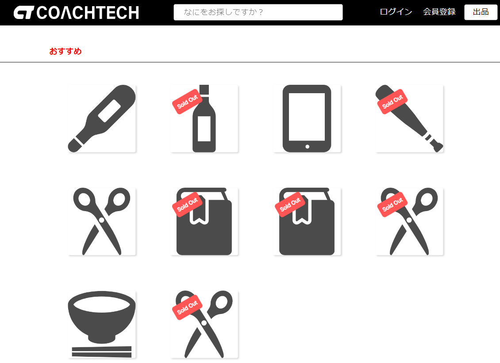
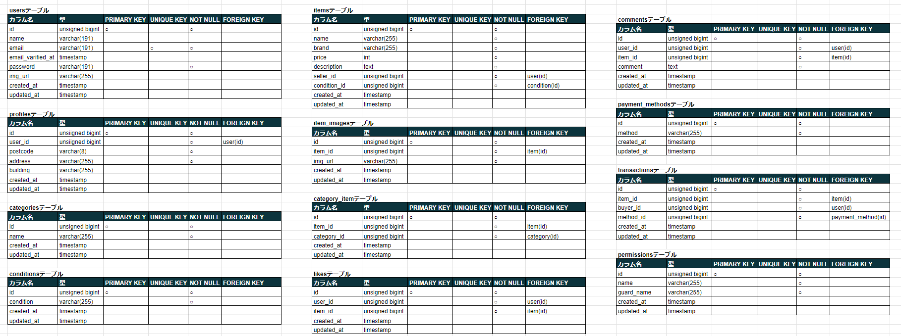
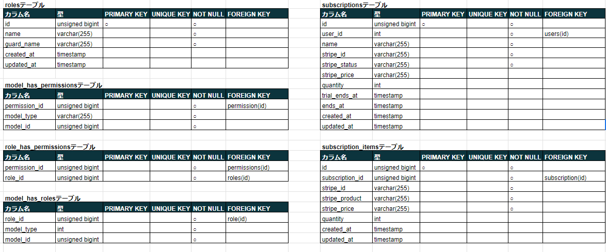
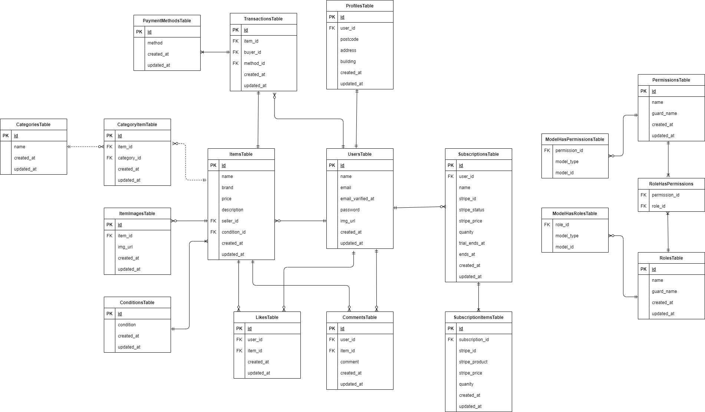

# Coachtech Flea Market
企業の独自フリマアプリ


## 作成した目的
coachtechブランドのアイテムの出品

## URL
- 開発環境: 'http://localhost/'
- phpMyAdmin: 'http://localhost:8080/'
- mailhog: 'http://localhost:8025/'
- 本番環境: 'http://54.150.197.191'

## 機能一覧
- 会員登録
- ログイン
- ログアウト
- 商品一覧表示
- 商品詳細表示
- 商品お気に入り追加
- 商品お気に入り削除
- 商品コメント追加
- 商品コメント削除
- 商品の出品
- 商品の購入
- 購入時の支払い方法変更
- ユーザー情報取得
- ユーザー購入商品一覧表示
- ユーザー出品商品一覧表示
- ユーザープロフィールの変更
- 管理画面

### 管理画面
- **管理者**
  - ユーザー一覧表示
  - ユーザーの削除
  - 登録者へのメール送信

## 使用技術
- **バックエンド**
  - PHP 8.2.21
  - Laravel 8.83.27
- **データベース**
  - MySQL 8.0.35
- **Webサーバー**
  - Nginx
- **メールサービス(開発環境)**
  - Mailhog

## テーブル設計



## ER図


## 環境構築
**Dockerビルド**
1. `git clone git@github.com:tyswtpooh55/FleaMarket.git`
2. DockerDesktopアプリを立ち上げる
3. `docker-compose up -d --build`

**Laravel環境構築**
1. PHPコンテナにログイン 
   `docker-compose exec php bash`
2. `composer install`
3. [.env.example]ファイルを[.env]ファイルにコピー
   `cp .env.example .env`
4. [.env]ファイルに以下の環境変数を追加
   ```
   APP_NAME="COACHTECH Flea Market"

   DB_CONNECTION=mysql
   DB_HOST=mysql
   DB_PORT=3306
   DB_DATABASE=laravel_db
   DB_USERNAME=laravel_user
   DB_PASSWORD=laravel_pass

   MAIL_FROM_ADDRESS=no-reply@example.com

   STRIPE_SECRET_KEY=sk_test_51PQ7hED470QL7wqoUa6qAtLGj2T19OmonASJvuCEw9J8Dmq8ElHGpoIBHupOJNsYtooyZ2lZFJ011oVJWjrsr9Uf00qxw74uER
    STRIPE_PUBLISHABLE_KEY=pk_test_51PQ7hED470QL7wqo2dnssmgMZvMgnoy9pc2x6qMtMZOJ0NeZb6MKyiPE94cELQecfK4sJlmJo0kD7Ti2D5tYV12w00CXHwcSIN

    CASHIER_CURRENCY=JPY
    CASHIER_CURRENCY_LOCALE=ja_JP
    CASHIER_LOGGER=stack
    ```
5. アプリケーションキーの作成
   `php artisan key:generate`
6. マイグレーションの実行
   `php artisan migrate`
7. シーディングの実行
   `php artisan db:seed`
8. ストレージリンクの作成
   `php artisan storage:link`

## 開発環境のダミーデータ
- 管理者
  - User名: `Admin`
  - Email: `admin@example.com`
  - Password: `adminpass`
- 利用者
  - User名: `Customer1`
  - Email: `customer1@example.com`
  - Password: `pass1234`

## 決済機能
- テストカード(Stripeによるテストカード)
  - 番号: `3566002020360505` (JCB)
    - 日付 : 任意の将来の日付
    - セキュリティコード : 任意の3桁の番号
